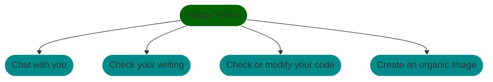

# Happy Totoro linebot
A smart Totoro that helps you with many things
Ryan Chen, 2022 fall Computational theory project

## Festures
- chat
- edit writing
- generate or modify code
- create image accoring to your description

### 1. Chat
>smart chat bot
- Supports multi language mixed conversasions
- Fixes input errors

### 2. Checks your writing
>Checks and fixes typing error in your writing
Example:

### 3. Code modifications
>Generates, modifies, and fixes your code
- Code generation example

- Code modification examples

### 4. Create organic images
>Generates organic images according to description
Examples:

## FSM diagram

